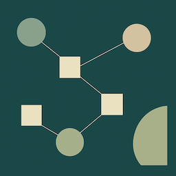

## Introduction

Software Engineer with 7 years of experience in distributed architectures, cloud services, and ETL data pipelines. Researching probabilistic deep learning applied electroencephalogram (EEG) signal classification intended for neurological rehabilitation at the University of Washington. Seeking PhD opportunities to continue research in probabilistic deep learning and open to further research in computational neuroscience.

## Parallel Programming

<a href="https://medium.com/parallel-programming" target="_blank">
  <i class="fab fa-medium fa-2x"></i>
</a>

This collection features white papers, blog posts, and software implementations that explore the breadth of parallel programming across multiple disciplines. It examines paradigms such as GPU programming, Apache Spark, and Hadoop MapReduce, highlighting how these technologies can accelerate large-scale data processing and computational tasks. The implementations leverage programming languages including C, C++, CUDA, and Java, demonstrating practical techniques and design patterns. Together, these resources provide a solid foundation for understanding, applying, and advancing parallel computing methods in both academic and industrial settings.

| Project | White Paper | Software | Technologies
|---|---|---|---|
| [Linear Algebra for Image Compression](https://medium.com/parallel-programming/linear-algebra-for-image-compression-2c0eebb8098c) | [Link](https://github.com/davisethan/eigenface/blob/main/Linear_Algebra_for_Image_Compression.pdf) | [Link](https://github.com/davisethan/eigenface/tree/main) | C |
| [High Performance Matrix Multiplication](https://medium.com/parallel-programming/high-performance-matrix-multiplication-402031cfc162) | [Link](https://github.com/davisethan/gemm/blob/main/High_Performance_Matrix_Multiplication.pdf) | [Link](https://github.com/davisethan/gemm/tree/main) | C++ and CUDA |
| [Ant Colony Optimization in a Hadoop Cluster](https://medium.com/parallel-programming/ant-colony-optimization-aco-in-a-hadoop-cluster-0b37e89098f3) | | [Link](https://github.com/davisethan/parallel_programming/tree/main/Hadoop/AntColonyOptimization) | Hadoop MapReduce and Java |
| [Triangle Counting in a Spark Cluster](https://medium.com/parallel-programming/triangle-counting-in-a-spark-cluster-ed10b006093f) | | [Link](https://github.com/davisethan/parallel_programming/tree/main/Spark/TriangleCounting) | Apache Spark and Java |
| [Hadoop Cluster in AWS EC2](https://medium.com/parallel-programming/hadoop-cluster-in-aws-ec2-ac982d91b1f6) | | | AWS |
| [Spark Cluster in AWS EC2](https://medium.com/parallel-programming/spark-cluster-in-aws-ec2-8cd3e0992d99) | | | AWS |

## Data Structures and Algorithms

<a href="https://medium.com/data-structures-and-algorithms-dsa" target="_blank">
  <i class="fab fa-medium fa-2x"></i>
</a>

This resource offers an in-depth introduction to patterns commonly encountered in data structures and algorithms. It organizes these concepts into 24 comprehensive categories, covering over 120 carefully selected problems along with detailed solutions. Each solution is accompanied by clear explanations, unit tests to verify correctness, and thorough complexity analyses to help you understand performance tradeoffs. This structured approach aims to build strong foundational problem-solving skills and deepen you mastery of algorithmic thinking.

| Category
|---
| [Sliding Windows](https://medium.com/data-structures-and-algorithms-dsa/sliding-windows-23727d654d8a)
| [Two Heaps](https://medium.com/data-structures-and-algorithms-dsa/two-heaps-1cafc6d0ef39)
| [K-way Merge](https://medium.com/data-structures-and-algorithms-dsa/k-way-merge-10fcb84661f5)
| [Top K Elements](https://medium.com/data-structures-and-algorithms-dsa/top-k-elements-e4e6643eb7d2)
| [Modified Binary Search](https://medium.com/data-structures-and-algorithms-dsa/modified-binary-search-c5cc1c71a5c5)
| [Subsets](https://medium.com/data-structures-and-algorithms-dsa/subsets-415a98cbb7bc)
| [Greedy Techniques](https://medium.com/data-structures-and-algorithms-dsa/greedy-techniques-1191967c51c0)
| [Backtracking](https://medium.com/data-structures-and-algorithms-dsa/backtracking-eff87a3b5d00)
| [Dynamic Programming](https://medium.com/data-structures-and-algorithms-dsa/dynamic-programming-4744e5653ca8)
| [Cyclic Sort](https://medium.com/data-structures-and-algorithms-dsa/cyclic-sort-d8d37284bdc0)
| [Topological Sort](https://medium.com/data-structures-and-algorithms-dsa/topological-sort-3b6bbaf83397)
| [Matrices](https://medium.com/data-structures-and-algorithms-dsa/matrices-5f8d54af9416)
| [Stacks](https://medium.com/data-structures-and-algorithms-dsa/stacks-6f36eaa4191a)
| [Graphs](https://medium.com/data-structures-and-algorithms-dsa/graphs-a952a51c5861)
| [Depth First Search](https://medium.com/data-structures-and-algorithms-dsa/depth-first-search-7a46feb6ffdf)
| [Breadth First Search](https://medium.com/data-structures-and-algorithms-dsa/breadth-first-search-e33939b988e9)
| [Tries](https://medium.com/data-structures-and-algorithms-dsa/tries-b0e48a6f307b)
| [Hash Maps](https://medium.com/data-structures-and-algorithms-dsa/hash-maps-ad87a06d14c6)
| [Counters](https://medium.com/data-structures-and-algorithms-dsa/counters-a2fcd3da83b2)
| [Union Find](https://medium.com/data-structures-and-algorithms-dsa/union-find-98e2df0877a3)
| [Two Pointers](https://medium.com/data-structures-and-algorithms-dsa/two-pointers-0f8561d167fd)
| [Fast and Slow Pointers](https://medium.com/data-structures-and-algorithms-dsa/fast-and-slow-pointers-7efd27bd375f)
| [Merge Intervals](https://medium.com/data-structures-and-algorithms-dsa/merge-intervals-32d3bf785e6b)
| [Linked Lists](https://medium.com/data-structures-and-algorithms-dsa/linked-lists-0ef5dc363fde)

## System Design

I gained experience designing cloud services such as blog storage, distributed caches, and distributed messaging queues, understanding their architectural principles and tradeoffs. I also studied how to leverage these services to build large-scale applications like YouTube, Google Maps, and Uber, exploring their scalability, reliability, and performance requirements. Additionally, I examined the design of real-world distributed systems including Google File System (GFS), Google BigTable, and critical consensus algorithms like Paxos and Raft, deepening my understanding of fault tolerance, consistency, and distributed coordination in modern cloud infrastructures.

| Certificates |
|---
| [Grokking Modern System Design Interview for Engineers & Managers](https://www.educative.io/verify-certificate/j2l3BzfGxmqPLvK7rFj0XPoOxzm7hA)
| [System Design Deep Dive: Real-World Distributed Systems](https://www.educative.io/verify-certificate/1j8yMXCLZZP9EAxJncyv2BjoOn9Xsp)
| [Grokking the System Design Interview](https://www.educative.io/verify-certificate/ovykgD5jjxrh8vK8og5ZWBSW4QZYj7BX6Tq)
