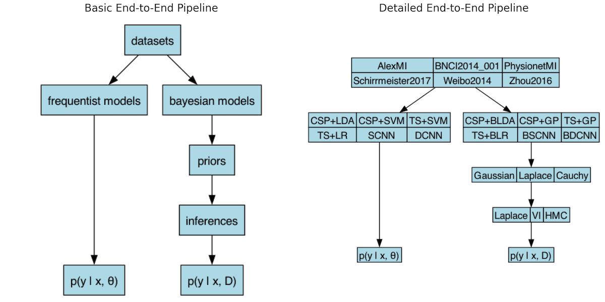
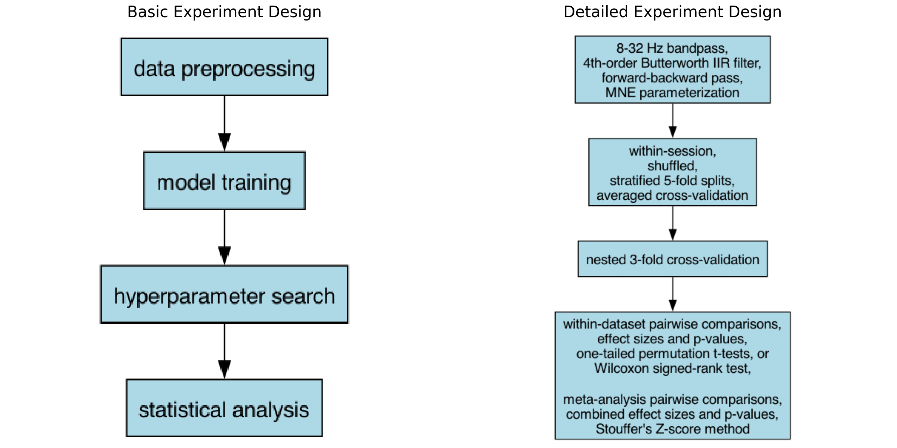
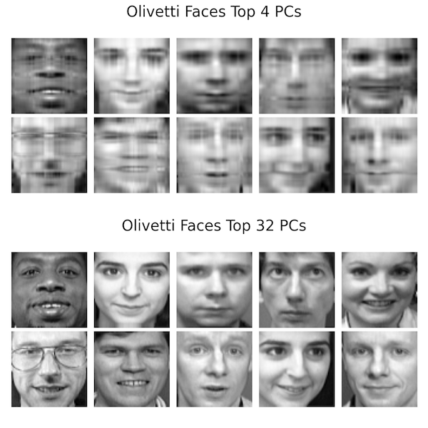

<a href="mailto:davise5@uw.edu">Contact</a> | <a href="assets/files/Ethan_Davis_CV_2025.pdf" target="_blank" rel="noopener noreferrer">Curriculum Vitae</a> | <a href="assets/files/Ethan_Davis_Resume_2025.pdf" target="_blank" rel="noopener noreferrer">Resume</a>

I am pursuing a PhD in computer science to research Bayesian and sequence machine learning for healthcare. My interests are generative modeling and reinforcement learning. Additional interests I have are representation learning and transfer learning.

- [Research Experience](#research-experience)
  - [MS Thesis](#ms-thesis)
    - [MS Thesis References](#ms-thesis-references)
  - [Future Directions of MS Thesis](#future-directions-of-ms-thesis)
    - [Future Directions References](#future-directions-references)
  - [Additional Research](#additional-research)
    - [Additional Research References](#additional-research-references)

# Research Experience

## MS Thesis

*500 word limit*

The goal of my MS thesis is to evaluate when Bayesian ML benefits motor-imagery electroencephalogram (MI-EEG) brain-computer interface (BCI) classification [[3, 4]](#ms-thesis-references). Motivations for MI-EEG/BCI research include assisting neurorehabilitation therapies and controlling robotic prosthetics [[2]](#ms-thesis-references). I compare analogous frequentist and Bayesian ML models from the three most popular types of MI-EEG classifiers: firstly, linear spatial filters, or secondly, Riemannian geometric spatial filters, plus training models, and thirdly deep learning [[1]](#ms-thesis-references). Metrics used to measure predictive performance come from discrimination, calibration, and sharpness [[3]](#ms-thesis-references).

My MS thesis experiment compares frequentist and Bayesian probability models. Frequentist models optimize parameters &#952; that minimize loss when predicting label y given example x. Bayesian models average over parameters &#952; making comprehensive predictions given all available information. Prior beliefs of the distribution for parameters &#952; and inference methods for approximating the often intractable evidence are additional requirements for Bayesian modeling [[3, 5]](#ms-thesis-references).

The datasets are popular options for MI-EEG modeling [[1]](#ms-thesis-references). The frequentist models are top-performing classifiers of these data in terms of accuracy [[1]](#ms-thesis-references). Our contribution considers the Bayesian analogs of these models and additional metrics. The acronyms of the models are as follows: common spatial pattern (CSP), tangent space (SP), linear discriminant analysis (LDA), support vector machine (SVM), logistic regression (LR), shallow convolutional neural network (SCNN), deep convolutional neural network (DCNN), Gaussian process (GP) [[2, 7, 3, 6, 5]](#ms-thesis-references).

The prior distributions range from light to heavy tailedness. Our choice of a Gaussian distribution is a standard baseline, though previous results have shown that heavy-tailed priors like the Laplace or Cauchy distributions are more expressive for training ML [[2]](#ms-thesis-references). Our experiment uses the three most common methods inference for ML: Laplace approximation, variational inference (VI), and sampling methods of which Hamiltonean Monte Carlo (HMC) is the golden standard [[3, 4]](#ms-thesis-references). These methods range from fastest and least accurate, to slowest and most accurate. Each technique has unique metrics that can be used to explain its performance, for example in terms of model improvement per computational unit: condition number of the Hessian matrix, evidence lower bound (ELBO), and effective sample size (ESS) for Laplace approximation, VI, and HMC respectively [[4, 8]](#ms-thesis-references).

The mother of all BCI benchmarks (MOABB) is a software library created for the purpose of reproducible BCI research [[1]](#ms-thesis-references). Its expert, minimal MI-EEG signal preprocessing, widely accepted methods of model selection, and rigorous statistical evaluation functions creates a standardized framework of BCI research experiment design allowing researchers to focus on designing novel ML models. The centralization of datasets offers model comparisons with statistically valid claims that some model/family empirically dominates another.

With my breadth of models, priors, and inferences, I can formally test multiple hypotheses for the purpose of evaluating when Bayesian ML benefits MI-EEG classification. My primary research question is whether Bayesian models outperform frequentist ones. Secondary research questions concern the effect of prior distribution tailedness, inference speed/accuracy tradeoff, and relative performance of the three types of MI-EEG classifiers.

### MS Thesis References

1. Chevallier, S., Carrara, I., Aristimunha, B., Guetschel, P., Sedlar, S., Lopes, B., Velut, S., Khazem, S., Moreau, T. (2021). The largest EEG-based BCI reproducibility study for open science: the MOABB benchmark. In J. Neural Eng.
2. Nam, C. S., Nijholt, A., & Lotte, F. (2018). Brain–Computer Interfaces Handbook: Technological and Theoretical Advances. CRC Press.
3. Bishop, C. M. (2016). Pattern recognition and machine learning. Springer.
4. Murphy, K. P. (2023). Probabilistic Machine Learning: Advanced Topics. MIT Press.
5. Deisenroth, M. P., Faisal, A. A., & Ong, C. S. (2020). Mathematics for machine learning. Cambridge University Press.
6. Bishop, C. M., & Bishop, H. (2023). Deep learning: Foundations and Concepts. Springer Nature.
7. Pennec, X., Sommer, S., & Fletcher, T. (2019). Riemannian Geometric statistics in medical image analysis. Academic Press.
8. Murphy, K. P. (2022). Probabilistic Machine Learning: An Introduction. MIT Press.

## Future Directions of MS Thesis

*300 word limit*

Sequence modeling can be used for MI-EEG that is sequential data. The core uncertainty quantification (UQ) of Bayesian ML benefits Markov decision processes (MDPs) under uncertainty, spatiotemporal dynamical systems, and in general reinforcement learning [[1, 2, 3, 4]](#future-directions-references). Furthermore, generative models can be used to train ML that is robust to distribution shift, a problem common to classifiers of noisy MI-EEG data [[2, 4, 5]](#future-directions-references).

Representation learning and inductive bias discovery such as graph learning can also be used to model MI-EEG [[2, 6]](). These techniques find hidden structures, assumptions in data that can be encoded in ML models for better representation. Examples include geometric deep learning that exploits symmetries of data during training [[7]](#future-directions-references). Another example is topological data analysis (TDA) that may use persistent homology to mine global features of data that are invariant to noise and deformation [[8]](#future-directions-references).

Transfer learning and foundation models are also impactful directions of BCI research [[4]](#future-directions-references). Statistical learning theory (SLT) such as probably approximately correct (PAC) bounds describe the theoretical generalizability of ML models [[9]](#future-directions-references). SLT can be used to describe the effectiveness of different types of BCI classifiers to model MI-EEG data. Additionally, SLT can help BCI researchers that desire MI-EEG classifers that can quickly adapt to cross-session and cross-subject scenarios.

Healthcare and biology applications beyond MI-EEG/BCI neuroscience research are interesting to me. ML is capable of improving our understanding and delivery of healthcare and medicine. In fact it is already doing so. Medical imaging technologies have improved from Riemannian geometrics statistics analysis and algorithms [[10]](#future-directions-references). Graph neural networks are rapidly reducing drug discovery costs [[6, 7]](#future-directions-references). Furthermore, time-series models of biosignals can drive the design of health monitoring wearables, including MI-EEG/BCI neuroscience devices [[4, 11]](#future-directions-references).

### Future Directions References

1. Bishop, C. M. (2016). Pattern recognition and machine learning. Springer.
2. Murphy, K. P. (2023). Probabilistic Machine Learning: Advanced Topics. MIT Press.
3. Brunton, S. L., & Kutz, J. N. (2019). Data-Driven science and engineering: Machine Learning, Dynamical Systems, and Control. Cambridge University Press.
4. Nam, C. S., Nijholt, A., & Lotte, F. (2018). Brain–Computer Interfaces Handbook: Technological and Theoretical Advances. CRC Press.
5. Bishop, C. M., & Bishop, H. (2023). Deep learning: Foundations and Concepts. Springer Nature.
6. Hamilton, W. L. (2022). Graph Representation learning. Springer Nature.
7. Bronstein, M. M., Bruna, J., Cohen, T., & Veličković, P. (2022). Geometric deep learning: grids, groups, graphs, geodesics, and gauges. arXiv (Cornell University).
8. Carlsson, G., & Vejdemo-Johansson, M. (2021). Topological Data Analysis with Applications. Cambridge University Press.
9. Shalev-Shwartz, S., & Ben-David, S. (2014). Understanding machine learning: From Theory to Algorithms. Cambridge University Press.
10. Pennec, X., Sommer, S., & Fletcher, T. (2019). Riemannian Geometric statistics in medical image analysis. Academic Press.
11. Prandoni, P., & Vetterli, M. (2008). Signal processing for communications. Collection Savoir suisse.

## Additional Research

*500 word limit*

In the year since starting my MS I explored several directions of research. Some of these rely on my cloud computing and systems architecture background more than statistical or ML modeling which is central to my MS thesis. Of these projects, only the 400-page textbook on data structures and algorithms that I authored was worked on before starting my MS.

Metaheuristic algorithms such as evolutionary learning are modern techniques for solving challenging optimization problems such as those in discrete space where exhaustive search solutions have combinatorial complexity [[3]](#additional-research-references). Explore-Exploit-Evaluate (EEE) is a framework I used to explore ant colony optimization (ACO) benchmarks for solving the traveling salesman problem (TSP) [[1]](#additional-research-references). I implemented ACO in Java and the Hadoop MapReduce framework [[2]](#additional-research-references). My publicly available software repository has documentation I wrote for creating a distributed Hadoop MapReduce cluster of AWS EC2 instances, and is how I ran ACO to solve the TSP. This documentation is also accessible as a <a href="https://medium.com/@davisethan/hadoop-cluster-in-aws-ec2-ac982d91b1f6" target="_blank" rel="noopener noreferrer">Medium post</a>.

High performance matrix multiplication is the backbone of modern deep learning [[4]](#additional-research-references). I built high performance general matrix multiplication (GEMM) in Nvidia CUDA, and CPU analogs using OpenMP and C++ Threads [[6]](#additional-research-references). I benchmarked these programs against third party libraries CuBLAS and BLAS. Formal statistcal analysis shows that for large square matrix sizes these five algorithms have distinct ranks of performance measured in terms of floating point operations per second (FLOPS) [[5]](#additional-research-references).

Linear algebra is the foundation of ML pillars that include principal component analysis (PCA) for dimensionality reduction [[7]](#additional-research-references). I wrote proofs of correctness for numerical linear algebra eigenvalue decomposition (EVD) and singular value decomposition (SVD) algorithms, the QR method and the power method with deflation [[8, 9]](#additional-research-references). I went on to implement these numerical algorithms in C, requiring specialized loop fusion to prevent numerical underflow [[10]](#additional-research-references).

Data structures and algorithms (DSA) are core to efficient computation. They are also classic demonstrations of problem-solving for software engineering. In a 400-page textbook that I authored, I introduce over 20 categories of strategies for solving DSA problems, and when to use them [[11, 12]](#additional-research-references). Over 120 DSA problems are presented with production software solutions, unit tests, explanation, and complexity analysis. The textbook is also available in the format of a <a href="https://medium.com/data-structures-and-algorithms-dsa" target="_blank" rel="noopener noreferrer">Medium publication</a>.

Triangle counting is used to analyze graphs such as social networks where a dense cluster of triangles indicates the existence of a community. I implemented triangle counting in Java and the Apache Spark framework [[13]](#additional-research-references). I also wrote documentation for how I created an Apache Spark cluster of AWS EC2 instances for distributed, cloud computing execution of my algorithm in my publicly available software repository. This documentation can also be accessed as a <a href="https://medium.com/@davisethan/spark-cluster-in-aws-ec2-8cd3e0992d99" target="_blank" rel="noopener noreferrer">Medium post</a>.

### Additional Research References

1. Davis, E. (2025, October 6). Exploration-Exploitation-Evaluation (EEE): a framework for metaheuristic algorithms in combinatorial optimization. arXiv.org. https://arxiv.org/abs/2510.05027
2. Ethan Davis. (2025). davisethan/aco: Badge release (v1.0.2). Zenodo. https://doi.org/10.5281/zenodo.17274214
3. Tsai, C., & Chiang, M. (2023). Handbook of Metaheuristic Algorithms: From Fundamental Theories to Advanced Applications. Elsevier.
4. Hwu, W. W., Kirk, D. B., & Hajj, I. E., PhD. (2022). Programming massively parallel processors: A Hands-on Approach. Morgan Kaufmann.
5. Davis, E. (2025a). High performance matrix multiplication. arXiv (Cornell University). https://doi.org/10.48550/arxiv.2509.04594
6. Ethan Davis. (2025). davisethan/gemm: DOI release (v1.0.1). Zenodo. https://doi.org/10.5281/zenodo.17299758
7. Deisenroth, M. P., Faisal, A. A., & Ong, C. S. (2020). Mathematics for machine learning. Cambridge University Press.
8. Strang, G. (2016). Introduction to linear algebra. Wellesley-Cambridge Press.
9. Davis, E. (2025). Linear Algebra for Image Compression. Zenodo. https://doi.org/10.5281/zenodo.17180358
10. Ethan Davis. (2025). davisethan/eigenface: DOI release (v1.0.1). Zenodo. https://doi.org/10.5281/zenodo.17299529
11. Davis, E. (2025). Data Structures and Algorithms. Zenodo. https://doi.org/10.5281/zenodo.17297422
12. Ethan Davis. (2025). davisethan/data_structures_algorithms: DOI release (v1.0.2). Zenodo. https://doi.org/10.5281/zenodo.17289626
13. Ethan Davis. (2025). davisethan/triangle_counting: DOI release (v1.0.1). Zenodo. https://doi.org/10.5281/zenodo.17299086

<!-- # Teaching & Mentoring

Assisting Prof. Erika Parsons in updating the course _Mathematics for Machine Learning_, including curriculum design, textbook selection, and assignment development and grading. Independently of the course, I curated MI-EEG BCI research directions and reproducibility standards (MOABB, Riemannian pipelines, GNNs) to align lab efforts and accelerate studies.

# Selected Industry Experience

**Software Engineer**, SeekOut – Bellevue, WA (2022–2024)  
Built and optimized data pipelines and distributed systems in C# and Azure, applying object-oriented design, SOLID principles, and automated testing to improve scalability, reliability, and maintainability of large-scale ETL and search infrastructure.

**Software Engineer**, Independent Project – Seattle, WA (2017–2020)  
Designed a fault-tolerant, microservices-based web application using Java, Spring Boot, Node.js, and AWS, implementing distributed systems principles for scalable cloud deployment.

**Software Engineer**, StackBrew – Redmond, WA (2015–2017)  
Developed a JavaScript AST interpreter and backend microservices (Node.js, Go) deployed on GCP, exploring collaborative editing algorithms (OT and CRDTs) to inform distributed software design.

# Conference Posters

|Conference|
|---|
|<a href="assets/files/pumps_poster.pdf" target="_blank" rel="noopener noreferrer">PUMPS+AI 2025 ACM Europe Summer School</a>|

# Certifications

|Certification|
|---|
|<a href="assets/files/pumps_certification.pdf" target="_blank" rel="noopener noreferrer">PUMPS+AI 2025 Statement of Accomplishment in CUDA workshops</a>| -->
